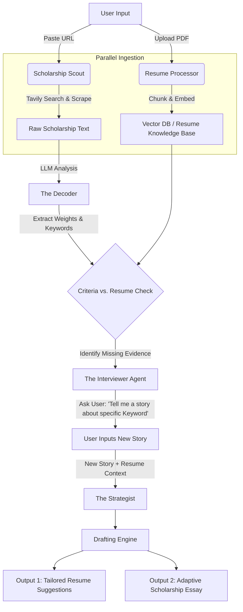

```mermaid
graph TD
    A[User Input] -->|Upload PDF| B(Resume Processor)
    A -->|Paste URL| C(Scholarship Scout)
    
    %% Parallel Processes
    subgraph "Parallel Ingestion"
    B -->|Chunk & Embed| D[Vector DB / Resume Knowledge Base]
    C -->|Tavily Search & Scrape| E[Raw Scholarship Text]
    end
    
    %% Analysis
    E -->|LLM Analysis| F[The Decoder]
    F -->|Extract Weights & Keywords| G{Criteria vs. Resume Check}
    D --> G
    
    %% The Critical Innovation Step
    G -->|Identify Missing Evidence| H[The Interviewer Agent]
    H -->|Ask User: 'Tell me a story about specific Keyword'| I[User Inputs New Story]
    
    %% Generation
    I -->|New Story + Resume Context| J[The Strategist]
    J --> K[Drafting Engine]
    
    %% Final Outputs
    K --> L[Output 1: Tailored Resume Suggestions]
    K --> M[Output 2: Adaptive Scholarship Essay]
```