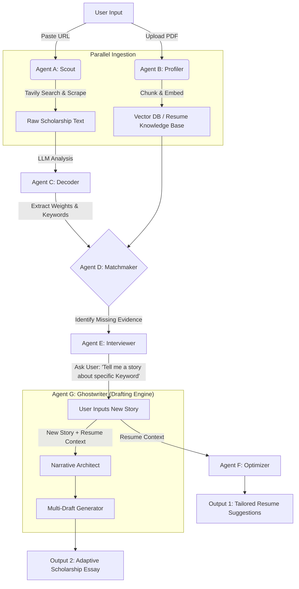

```mermaid
graph TD
    A[User Input] -->|Upload PDF| B(Agent B: Profiler)
    A -->|Paste URL| C(Agent A: Scout)
    
    %% Parallel Processes
    subgraph "Parallel Ingestion"
    B -->|Chunk & Embed| D[Vector DB / Resume Knowledge Base]
    C -->|Tavily Search & Scrape| E[Raw Scholarship Text]
    end
    
    %% Analysis
    E -->|LLM Analysis| F[Agent C: Decoder]
    F -->|Extract Weights & Keywords| G{Agent D: Matchmaker}
    D --> G
    
    %% The Critical Innovation Step
    G -->|Identify Missing Evidence| H[Agent E: Interviewer]
    H -->|Ask User: 'Tell me a story about specific Keyword'| I[User Inputs New Story]
    
    %% Generation
    subgraph "Agent G: Ghostwriter (Drafting Engine)"
    I -->|New Story + Resume Context| J[Narrative Architect]
    J --> K[Multi-Draft Generator]
    end

    %% Resume Optimization
    I -->|Resume Context| L[Agent F: Optimizer]
    
    %% Final Outputs
    L --> M[Output 1: Tailored Resume Suggestions]
    K --> N[Output 2: Adaptive Scholarship Essay]
```